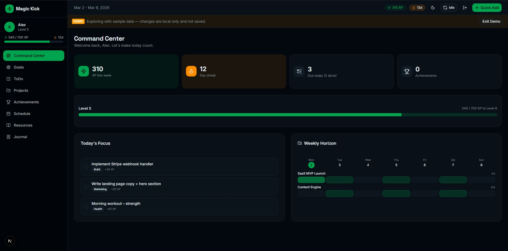

# Magic Kick

## 30-Second Pitch

Magic Kick is a gamified personal productivity OS for solo builders who want tasks, goals, projects, and progress feedback in one place. It combines an offline-first local store with Firebase sync so work is still usable when the network is unreliable. The product focus is a fast daily command center that turns consistent execution into visible momentum.



## Current Status

- Stage: MVP+
- Scope: Auth, command center, tasks, goals, projects, achievements, resources, schedule, journal, and offline-first Firebase sync
- Adoption/Process: Solo-founder workflow using issue -> branch -> PR discipline with CI and repo policy checks

## Tech Stack

| Layer | Choice |
|---|---|
| Framework | Next.js 16 (App Router) + React 19 + TypeScript |
| Styling | Tailwind CSS v4 + shadcn/ui + Radix UI |
| State | Zustand with localStorage persistence |
| Backend | Firebase Auth + Cloud Firestore |
| Analytics | Vercel Analytics |
| Tooling | npm, TypeScript, ESLint, GitHub Actions |

## Setup

### Prerequisites

- Node.js 20+
- npm
- Firebase project credentials for local development

### Commands

```bash
npm install
npm run dev
npm run build
npm run test
```

### Environment

1. Copy `.env.example` to `.env.local`.
2. Fill in:
   - `NEXT_PUBLIC_FIREBASE_API_KEY`
   - `NEXT_PUBLIC_FIREBASE_AUTH_DOMAIN`
   - `NEXT_PUBLIC_FIREBASE_PROJECT_ID`
   - `NEXT_PUBLIC_FIREBASE_STORAGE_BUCKET`
   - `NEXT_PUBLIC_FIREBASE_MESSAGING_SENDER_ID`
   - `NEXT_PUBLIC_FIREBASE_APP_ID`
3. Optional for emulator usage:
   - `NEXT_PUBLIC_FIREBASE_USE_EMULATOR=true`

### Local Development

```bash
npm run emulators
npm run dev
```

Open `http://localhost:3000`.

## Deployment

- Hosting target: Vercel for the web app, Firebase for auth and Firestore services
- Production URL: not published in this repository yet

## Documentation

- [Architecture](docs/ARCHITECTURE.md)
- [Roadmap](docs/ROADMAP.md)
- [Sprint Backlog](docs/SPRINT_BACKLOG.md)
- [Contributing Guide](CONTRIBUTING.md)
- [Changelog](CHANGELOG.md)
- [PRD](docs/PRD.md)
- [Decisions Log](docs/DECISIONS_LOG.md)
- [Daily Checklist](docs/DAILY_CHECKLIST.md)
- [Next Session Start](docs/NEXT_SESSION_START.md)
- [Workflow Automation Playbook](docs/WORKFLOW_AUTOMATION_PLAYBOOK.md)

## Workflow

- Create a feature branch from `main`
- Keep commits scoped and use `type(scope): short description`
- Run `npm run lint` and `npm run build` before committing
- Update `CHANGELOG.md` for user-facing changes

## License

Private repository. All rights reserved.
