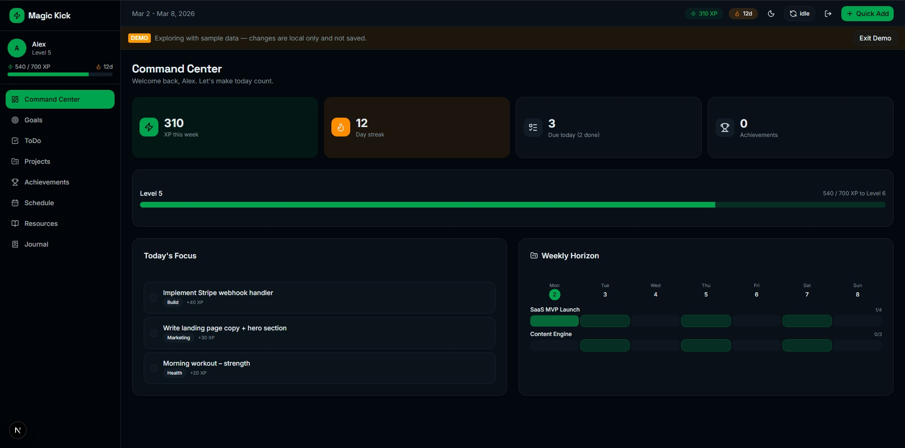

# Magic Kick

> Personal internal-operations system and AI-SDLC sandbox: tasks, goals, projects, schedule, journal, Firebase sync, AI coaching, summaries, and workflow automation.

Magic Kick is not a commercial product. It is a private-use internal tool that I keep public as implementation proof: a realistic, working system for managing personal execution, project flow, scheduling, reflection, and AI-assisted routines.

It demonstrates the kind of product and engineering work behind SME internal tools:

- turning scattered work into structured modules
- modeling goals, projects, tasks, schedule blocks, resources, and journal entries
- building dashboard-style operational visibility
- adding AI assistance where it supports review, planning, coaching, and summaries
- maintaining a documented AI-assisted development workflow



---

## Public Proof Role

Magic Kick supports my positioning as an AI Systems Consultant and Technical Product Manager.

It is best understood as:

```text
Internal tool proof
+ AI-assisted workflow proof
+ delivery-system sandbox
```

It is not positioned as:

```text
SaaS product
consumer productivity app
client-ready SME solution
```

The value is in the implementation evidence: data models, modules, auth, sync, AI routes, UI density, workflow rules, and iterative delivery discipline.

---

## What This Proves

### Internal tools and dashboards

Magic Kick contains a modular command center for goals, projects, schedule, tasks, resources, journal, achievements, and execution feedback.

This supports the same delivery pattern used in SME internal tools:

- identify the operational objects
- model their states and relationships
- make ownership, dates, progress, and risk visible
- reduce scattered tracking across notes, calendars, and spreadsheets

### AI workflow implementation

The app includes AI-oriented surfaces and backend routes for:

- coaching
- schedule suggestions
- retrospective summaries
- weekly summaries
- insights and risk/pattern logic

AI is not treated as magic text generation. It is wrapped around real workflow context and bounded by existing data structures.

### AI-SDLC practice

The repository is also a sandbox for practicing AI-assisted software delivery:

```text
Research -> design discussion -> notes -> GitHub issue -> implementation -> PR -> review log
```

Recent work shows this pattern in practice through scoped project and schedule improvements, ADRs, changelog entries, and UI iteration.

---

## Current Status

Magic Kick is a personal-use tool and AI-SDLC sandbox.

The product surface is intentionally capped at the existing modules:

1. Command Center
2. Goals
3. Todo
4. Projects
5. Achievements
6. Schedule
7. Resources
8. Journal
9. XP / Levels

Future work is limited to:

- personal-use fixes
- scoped AI-workflow experiments
- refinement inside existing modules
- documentation of decisions and learning

No broad SaaS roadmap is planned.

---

## Main Capabilities

| Area | Capability |
|---|---|
| Command Center | Daily operating surface for priorities, progress, and execution feedback |
| Goals | Strategic direction and longer-term outcomes |
| Projects | Project identity, status, dates, links, milestones, detail panels, and workflow visibility |
| Todo | Backlog, daily focus, task states, due dates, categories, and schedule-linked tasks |
| Schedule | Time blocks, editable notes, linked tasks, category metadata, due-date scheduling and unscheduling |
| Journal | Reflection and retrospective capture |
| Resources | Personal knowledge and reusable references |
| Achievements / XP | Motivation and feedback loop |
| AI Layer | Coaching, planning, summaries, risk/pattern support, and workflow review experiments |

---

## Tech Stack

| Layer | Choice |
|---|---|
| Framework | Next.js 16 App Router + React 19 + TypeScript |
| Styling | Tailwind CSS v4 + shadcn/ui + Radix UI |
| State | Zustand with localStorage persistence |
| Backend | Firebase Auth + Cloud Firestore |
| AI | Anthropic SDK through server routes |
| Analytics | Vercel Analytics |
| Tooling | npm, TypeScript, ESLint, GitHub Actions |

---

## Architecture Snapshot

```text
Next.js App Router
  -> authenticated app shell
  -> module surfaces
  -> Zustand local store
  -> localStorage persistence
  -> Firestore sync
  -> AI API routes
  -> documented AI-SDLC workflow
```

The app is offline-first from the UI perspective. Firestore is the remote sync target, while local state keeps the app responsive for personal daily use.

---

## Documentation

| Document | Purpose |
|---|---|
| [Architecture](docs/ARCHITECTURE.md) | Current system shape, module relationships, sync, and AI layer |
| [Decisions Log](docs/DECISIONS_LOG.md) | ADR-style record of important design and governance choices |
| [Firebase Architecture](docs/FIREBASE_ARCHITECTURE.md) | Auth, Firestore, sync, and data-boundary details |
| [Workflow Automation Playbook](docs/WORKFLOW_AUTOMATION_PLAYBOOK.md) | How AI-assisted workflow experiments are scoped and reviewed |
| [Sandbox Rules](docs/SANDBOX_RULES.md) | Scope boundary for personal-use fixes and experiments |
| [Daily Checklist](docs/DAILY_CHECKLIST.md) | Daily operating checklist |
| [Changelog](CHANGELOG.md) | User-facing and proof-of-work history |

---

## Setup

### Prerequisites

- Node.js 20+
- npm
- Firebase project credentials for local development

### Commands

```bash
npm install
npm run dev
npm run build
npm run typecheck
npm run lint
```

### Environment

1. Copy `.env.example` to `.env.local`.
2. Fill in the Firebase public client values.
3. Add AI-related server environment values only when testing AI routes locally.
4. Optional for emulator usage:

```text
NEXT_PUBLIC_FIREBASE_USE_EMULATOR=true
```

### Local Development

```bash
npm run emulators
npm run dev
```

Open `http://localhost:3000`.

---

## Deployment

- Web app: Vercel
- Auth and data: Firebase Auth + Cloud Firestore
- Production URL: not published in this repository

The app is public as source code, not as a shared production service.

---

## Workflow

- Create a focused branch from the active base.
- Keep commits scoped and use `type(scope): short description`.
- Run `npm run lint`, `npm run typecheck`, and `npm run build` before merging.
- Update `CHANGELOG.md` for user-facing changes.
- Record meaningful product/architecture decisions in `docs/DECISIONS_LOG.md`.

---

## Suggested Repository Metadata

Recommended GitHub description:

```text
Personal internal-operations system and AI-SDLC sandbox: tasks, goals, projects, schedule, journal, Firebase sync, AI coaching, summaries, and workflow automation.
```

Recommended topics:

```text
internal-tools
ai-workflows
workflow-automation
productivity-system
nextjs
typescript
firebase
firestore
ai-assisted-development
technical-product-management
dashboard
proof-of-work
```

---

## License

Private personal project. All rights reserved.
